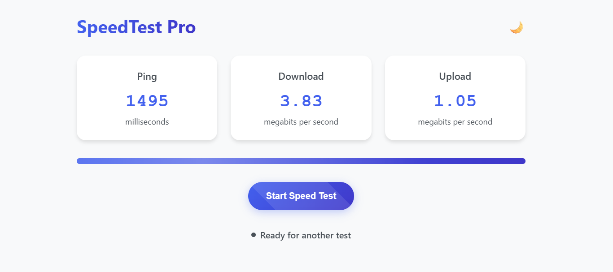

# 🌐 SpeedTest Pro

A sleek, modern, and responsive internet speed test web app built using vanilla HTML, CSS, and JavaScript. SpeedTest Pro allows users to quickly check their ping, download, and upload speeds with beautiful animations, dark/light theme toggle, and a celebratory confetti effect upon completion.

## 🚀 Features

- ✅ **Test Ping, Download, and Upload speeds**
- 🎨 **Dark/Light mode toggle**
- ⚡ **Animated transitions with Animate.css**
- 🧩 **Confetti animation on completion**
- 📱 **Responsive and mobile-friendly**
- 🎯 **Minimal dependencies (no libraries except Animate.css CDN)**

## 📸 Demo

> Want a live demo? [Host it on GitHub Pages](https://tikesh-sahu-git.github.io/SpeedTest-Pro/) or any static server to try it out!

## 🛠️ How It Works

- **Ping Test:** Measures the latency of a request to [httpbin.org](https://httpbin.org/get).
- **Download Test:** Downloads a 1MB file and calculates the Mbps.
- **Upload Test:** Uploads a 1MB blob to [httpbin.org](https://httpbin.org/post) and calculates the Mbps.

All tests run asynchronously and update a visual progress bar with live status updates.

> 💡 This project is designed to be run as a single HTML file with no external JavaScript or CSS files required.

## 🎨 Technologies Used

- HTML5 & CSS3 (with CSS custom properties for theming)
- Vanilla JavaScript (ES6+)
- [Animate.css](https://animate.style/) for UI animations

